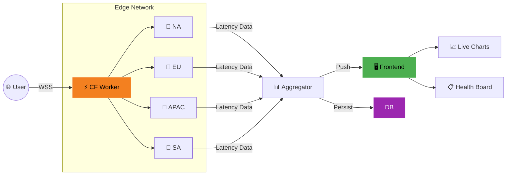
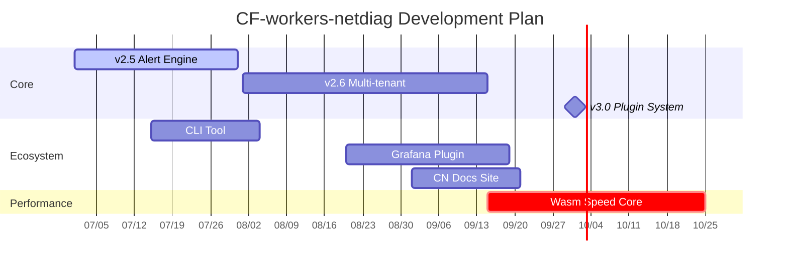

<!-- ========== 动态横幅与身份标识 ========== -->
<p align="center">
  
</p>

<h1 align="center">👋 Hi, I'm <a href="https://github.com/BlueDriftHK" style="color: #F38020; text-decoration: none;">BlueDriftHK</a></h1>

<p align="center">
  
</p>

<!-- 核心数据指标（暗色模式友好） -->
<p align="center">
  
  
  
  
</p>

---

## 🧑‍💻 About Me

我是一名专注于 **边缘计算 (Edge Computing)** 的架构师与全栈开发者。我的使命是将复杂的网络诊断能力封装为轻量、开箱即用的 Serverless 工具。

- 🔭 **Current Focus**: 打造 **[CF-workers-netdiag](https://github.com/BlueDriftHK/CF-workers-netdiag)** —— 基于 WebSocket + HLS.js 的全球毫秒级延迟透视仪
- 🌱 **Exploring**: WebAssembly on Edge, QUIC Protocol, WinterCG Standards
- 🎯 **Vision**: 让每位开发者 5 分钟内拥有企业级全球网络监控面板
- ⚡ **Philosophy**: Code as Art, Latency as Justice
- 💬 **Ask me about**: Cloudflare Workers, Real-time Systems, Network Diagnostics

---

## 📐 Design Philosophy

<div align="center">
<table>
<tr>
<td width="33%" align="center" valign="top">
<h3>⚡ Edge-First</h3>
<p><sub>计算贴近数据源<br/>延迟优先于吞吐</sub></p>
</td>
<td width="33%" align="center" valign="top">
<h3>🔒 Zero Trust</h3>
<p><sub>不信任任何网络层<br/>最小权限原则</sub></p>
</td>
<td width="33%" align="center" valign="top">
<h3>🧩 Composable</h3>
<p><sub>小工具优于大平台<br/>模块独立可替换</sub></p>
</td>
</tr>
</table>
</div>

---

## 🎯 Tech Radar

| Domain | ✅ Adopt | 🧪 Trial | 🔍 Assess | ⏸️ Hold |
|:---|:---|:---|:---|:---|
| **Runtime** | CF Workers, Node.js | Bun, Deno | WinterCG | Traditional VMs |
| **Protocol** | WebSocket, HTTP/3 | QUIC, WebTransport | gRPC-Web | Long Polling |
| **Storage** | KV, D1, R2 | Vectorize, Hyperdrive | Turso | Self-hosted DB |
| **Frontend** | Chart.js, HLS.js | D3.js, Observable | WebGL Viz | Heavy Frameworks |
| **Tooling** | Wrangler, Vitest | Biome, Oxc | Terraform CF | Webpack |

---

## 🏗️ Architecture Overview

> `CF-workers-netdiag` 全球边缘节点工作流

<div align="center">



*💡 Tip: Rotate device for better architecture view on mobile*

</div>

---

## ✨ Feature Matrix

| Module | Capability | Implementation |
|:---|:---|:---|
| 🚀 **Speed Test** | Parallel probe 10+ nodes, <200ms response | CF Workers + Edge Functions |
| 📈 **Live Charts** | ms-level curves, drag-zoom, multi-node compare | Chart.js + WebSocket |
| 🔔 **Smart Alerts** | Custom thresholds, auto-highlight anomalies | Rule Engine (v2.5) |
| 🌍 **Global Reach** | Auto nearest-node, real user path simulation | CF Anycast |
| 🔌 **Open API** | RESTful + GraphQL dual protocol | Hono Router |
| 🧩 **Zero Cost** | No server, pay-per-request, deploy in seconds | Wrangler + Free Tier |

---

## 🚀 Quick Start

```bash
# Clone
git clone https://github.com/BlueDriftHK/CF-workers-netdiag.git && cd CF-workers-netdiag

# Install & Dev
npm install && npx wrangler dev

# Deploy (requires CF account)
npx wrangler login && npx wrangler publish
```

> 💡 After deploy, you get a `*.workers.dev` domain instantly!

### 🔧 Environment Variables

| Variable | Description | Example |
|:---|:---|:---|
| `NODE_LIST` | Speed test nodes (JSON array) | `["node1.example.com"]` |
| `REFRESH_INTERVAL` | Refresh interval (ms) | `1000` |

> ⚠️ **Security**: Never hardcode secrets in `wrangler.toml`! Use `wrangler secret put <KEY>` instead.

See [`.env.example`](https://github.com/BlueDriftHK/CF-workers-netdiag/blob/main/.env.example) for full config.

---

## 🗺️ Roadmap 2026 H2

<div align="center">



</div>

---

## 📊 GitHub Analytics

<p align="center">
  
  
</p>

<p align="center">
  
</p>

<p align="center">
  
</p>

---

## 📝 Featured Writing

- [WebSocket Retry Strategies at the Edge](https://github.com/BlueDriftHK/CF-workers-netdiag/blob/main/docs/websocket-retry.md) — Jun 2026
- [CF Workers Cold Start: 80ms → 12ms](https://github.com/BlueDriftHK/CF-workers-netdiag/blob/main/docs/cold-start.md) — May 2026
- [HLS.js Adaptive Bitrate for Low Bandwidth](https://github.com/BlueDriftHK/CF-workers-netdiag/blob/main/docs/hls-adaptive.md) — May 2026

> 🔗 More in [Project Wiki](https://github.com/BlueDriftHK/CF-workers-netdiag/wiki)

---

## 💬 Community Pulse

> _"Deployed in 5 mins, faster than our internal tools."_ — @devops-chen, SRE  
> _"Elegant WebSocket retry logic, adopted in our push service."_ — @net-fanatic  
> _"Finally, an out-of-box edge speed tester!"_ — HN Comment

📢 **Using it?** Share your story in [Show & Tell](https://github.com/BlueDriftHK/CF-workers-netdiag/discussions/categories/show-and-tell)!

---

## 🤝 Contributing

1. Fork → Create feature branch (`git checkout -b feature/Amazing`)
2. Commit with convention (`git commit -m '✨ feat: add amazing feature'`)
3. Push & Open PR with description + test results

### Commit Convention

| Type | Icon | Description |
|:---|:---|:---|
| `feat` | ✨ | New feature |
| `fix` | 🐛 | Bug fix |
| `docs` | 📚 | Documentation |
| `perf` | 🚀 | Performance |
| `refactor` | ♻️ | Refactor |
| `test` | ✅ | Tests |

---

## 📫 Connect

<p align="left">
  <a href="mailto:asiacomk@gmail.com"></a>
  <a href="https://x.com/BlueDriftHK"></a>
  <a href="https://t.me/BlueDriftHK"></a>
  <a href="https://github.com/BlueDriftHK/CF-workers-netdiag/discussions"></a>
</p>

---

## 💖 Support

- ⭐ Star this repo
- 🐛 Report issues or suggest features
- ☕ [Sponsor on GitHub](https://github.com/sponsors/BlueDriftHK)

Licensed under **GNU GPL v3.0**. Build freely, grow together.

---

<p align="center">
  
</p>

<p align="center">
  <sub>⭐️ If this helps, please star! 😊<br/>🔮 Stay curious, stay innovative.</sub>
</p>
