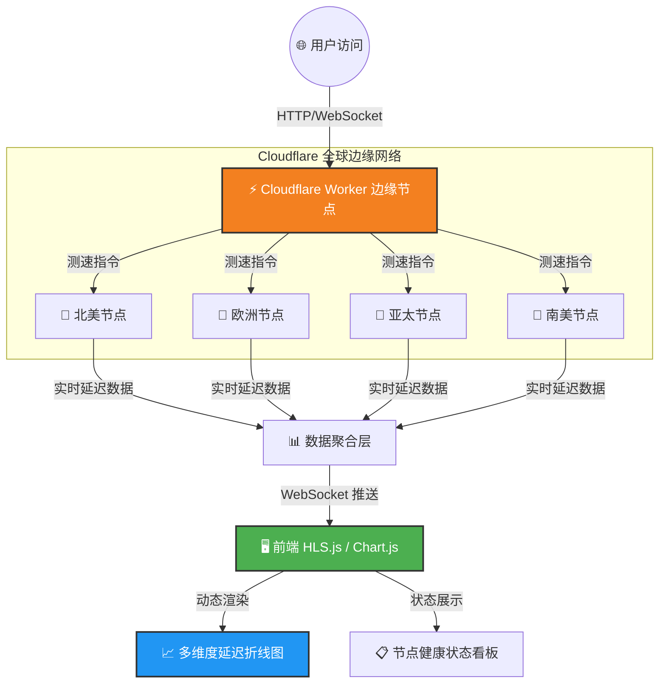

<!-- ========== 顶部炫酷横幅 ========== -->
<p align="center">
  
</p>

<h1 align="center">👋 你好，我是 <a href="https://github.com/BlueDriftHK" style="color: #F38020;">BlueDriftHK</a></h1>

<!-- 动态标语 - 改用 SVG 直接嵌入（不会因外链失败而消失） -->
<p align="center">
  
  
  
  
</p>

<!-- 访客计数器 + 炫酷徽章组合（使用国内可访问的 komarev 镜像） -->
<p align="center">
  
  
  
</p>

<!-- ========== 项目实时状态徽章（自动获取数据） ========== -->
<p align="center">
  <a href="https://github.com/BlueDriftHK/CF-workers-netdiag">
    
    
    
    
    
  </a>
</p>

---

<!-- ========== 关于我 ========== -->
## 🧑‍💻 关于我 · About Me

我是一名 **边缘计算架构师** 与 **全栈工具开发者**，热衷于利用 Cloudflare Workers 将复杂的网络诊断能力封装成开箱即用的轻量级工具。

- 🔭 **当前专注**：全力打磨主力项目 **[CF-workers-netdiag](https://github.com/BlueDriftHK/CF-workers-netdiag)** —— 基于 **WebSocket + HLS.js** 的毫秒级全球网络延迟透视仪。
- 🌱 **技术探索**：深入 HLS 流媒体协议、边缘节点智能路由、实时数据可视化。
- 🎯 **项目愿景**：让每一位开发者都能在 5 分钟内拥有自己的全球网络质量监控面板。
- ⚡ **极客信条**：代码即艺术，性能即正义。
- 💬 **技术话题**：边缘计算、Serverless、实时通信、开源生态。

---

<!-- ========== 项目架构图（改用静态 Mermaid，GitHub 原生支持） ========== -->
## 🏗️ 项目核心架构 · Architecture



---

<!-- ========== 核心功能亮点 ========== -->
## ✨ 功能矩阵 · Features

| 模块 | 核心能力 | 技术实现 |
| :--- | :--- | :--- |
| 🚀 **极速测速** | 并行探测全球 10+ 边缘节点，延迟数据 < 200ms 返回 | Cloudflare Workers + 边缘函数 |
| 📈 **实时图表** | 毫秒级动态曲线，支持拖拽缩放与多节点对比 | Chart.js + WebSocket 全双工 |
| 🔔 **智能告警** | 延迟阈值自定义，异常节点自动高亮提醒 | 内置规则引擎（v2.5 规划中） |
| 🌍 **全球覆盖** | 自动就近选择节点，真实模拟用户访问链路 | Cloudflare Anycast 网络 |
| 🧩 **零成本部署** | 无需购买服务器，部署即用，按调用计费 | Wrangler + Free Tier |

---

## 🛠️ 技术栈 · Tech Stack

### ☁️ 基础设施与运行时


### 🎨 前端与可视化


### 🔧 开发者工具


---

<!-- ========== 快速开始 ========== -->
## 🚀 一键部署 & 本地运行

```bash
# 1. 克隆项目
git clone https://github.com/BlueDriftHK/CF-workers-netdiag.git
cd CF-workers-netdiag

# 2. 安装依赖
npm install

# 3. 本地开发
npx wrangler dev

# 4. 部署到全球边缘（需 Cloudflare 账号）
npx wrangler login
npx wrangler publish
```

> 💡 部署后你会获得一个 `*.workers.dev` 域名，即刻拥有自己的全球延迟监控面板！

---

<!-- ========== GitHub 统计（使用国内可能访问更稳定的服务） ========== -->
## 📊 GitHub 数据墙

<p align="center">
  
  
</p>

<!-- 备选：GitHub 官方贡献图（更稳，但缺少动态效果） -->
<p align="center">
  
</p>

<!-- 如果不介意偶尔加载慢，也可以保留之前的 3D 图，这里同时保留两种（优先显示稳定的） -->
<!-- 
<p align="center">
  
</p>
-->

<!-- GitHub 成就奖杯（如果加载慢可以注释掉） -->
<p align="center">
  
</p>

---

<!-- ========== 更新日志速览 ========== -->
## 📰 近期更新 · Changelog

| 日期 | 版本 | 更新亮点 |
| :--- | :--- | :--- |
| 2026-06-01 | **v2.4.1** | 🐛 修复极端弱网下 WebSocket 死循环重连 |
| 2026-05-29 | **v2.4.0** | 🚀 优化断线重连机制，图表内存泄漏全面修复 |
| 2026-05-20 | **v2.3.0** | 🌍 新增欧洲中部节点测速支持，界面毛玻璃效果 |
| 2026-05-10 | **v2.2.0** | 💾 增加测速历史记录（IndexedDB 本地持久化） |
| 2026-04-28 | **v2.1.0** | 🎉 首个公开版本发布，基础测速与双端适配 |

> 📌 完整变更记录：[CHANGELOG.md](https://github.com/BlueDriftHK/CF-workers-netdiag/blob/main/CHANGELOG.md)

---

<!-- ========== 贡献指南 ========== -->
## 🤝 共建生态 · Contribution

> **“独行快，众行远。”** 欢迎所有形式的贡献！

1. **Fork** 本仓库并创建特性分支 (`git checkout -b feature/AmazingFeature`)
2. **提交** 改动 (`git commit -m '✨ feat: 增加某炫酷功能'`)
3. **推送** 到远程 (`git push origin feature/AmazingFeature`)
4. 开启一个 **Pull Request**，描述改动与测试情况。

### 📝 Commit 规范

| 类型 | 图标 | 说明 |
| :--- | :--- | :--- |
| `feat` | ✨ | 新增功能 |
| `fix` | 🐛 | 修复 Bug |
| `docs` | 📚 | 文档更新 |
| `style` | 💄 | 代码格式调整 |
| `refactor` | ♻️ | 重构（不改变功能） |
| `perf` | 🚀 | 性能优化 |
| `test` | ✅ | 增加测试 |
| `chore` | 🔧 | 构建/工具配置变动 |

---

<!-- ========== 联系与支持 ========== -->
## 📫 连接我 · Connect

<p align="left">
  <a href="mailto:asiacomk@gmail.com"></a>
  <a href="https://twitter.com/BlueDriftHK"></a>
  <a href="https://t.me/BlueDriftHK"></a>
  <a href="https://github.com/BlueDriftHK"></a>
</p>

> 或者直接在 GitHub Issues 中 @我，秒回！

---

## 💖 支持项目

- ⭐ **Star** 这个仓库 —— 让更多开发者发现它。
- 🐛 提交 **Issue** —— 反馈问题或提出脑洞需求。
- ☕ **赞助** —— 点击 [GitHub Sponsors](https://github.com/sponsors/BlueDriftHK) 支持持续迭代。

所有代码遵循 **GNU GPL v3.0** 开源协议。

---

<!-- ========== 炫酷页脚 ========== -->
<p align="center">
  
</p>

<p align="center">
  <i>⭐️ 如果我的项目对你有帮助，请给个 Star 吧！😊</i>
  <br />
  <i>🔮 保持好奇，保持创新。</i>
</p>
